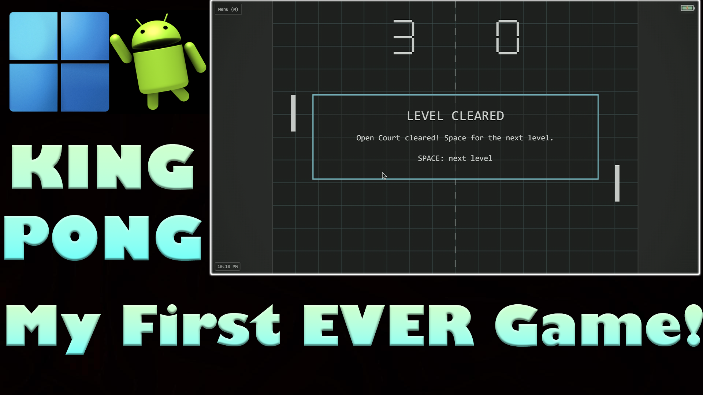
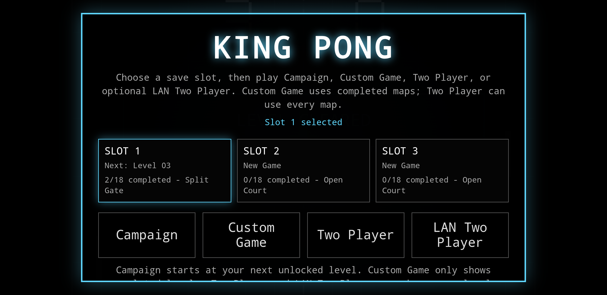
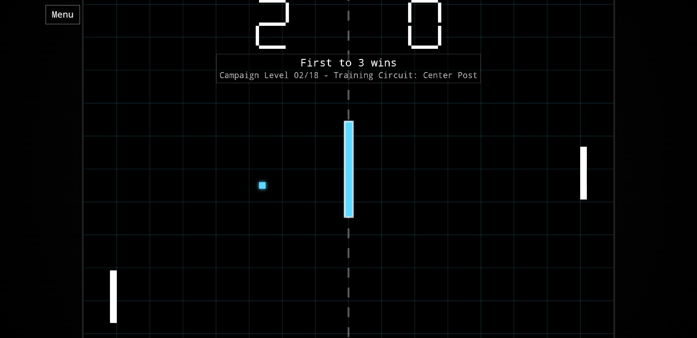
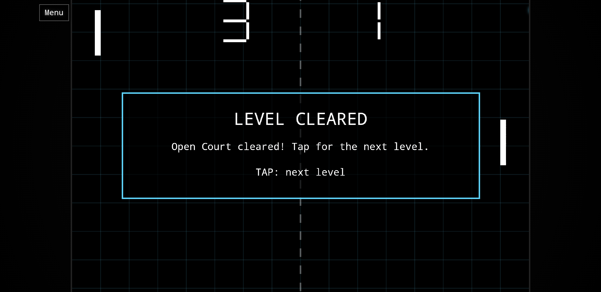
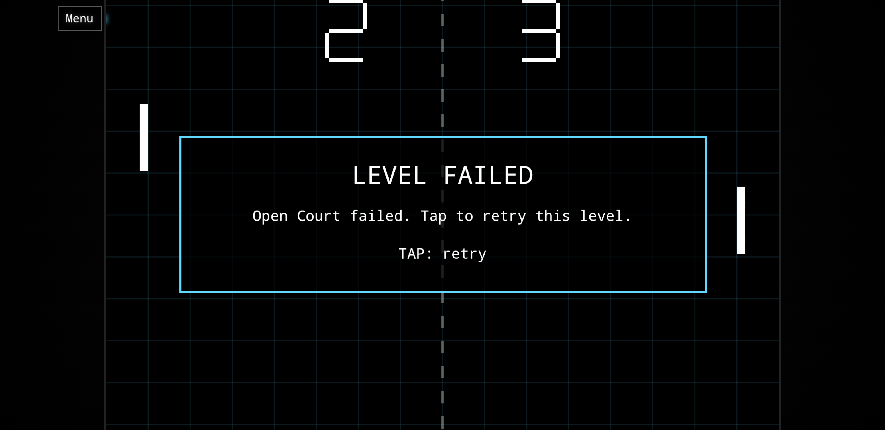

King Pong is a Pong-inspired Android and Windows arcade campaign game that I made in my free time.

It features campaign progression, language detection, controller support, touch controls, local two-player mode, LAN play, saves, battery and clock indicators, and a secret ending.

The project was developed with AI-assisted coding and packaging help, then manually tested, debugged, and polished to give it that human touch.

Feel free to test it out, play around with it, and modify it. Hope you enjoy it!

Made by: King Alex Gilbert

## Gameplay Demo

Watch the official King Pong gameplay demo:

[King Pong - Android and Windows Gameplay Demo](https://youtu.be/2Z1foE1dnKw)

## Screenshots

### Title Screen

### Gameplay

### Level Cleared

### Level Failed

## Downloads:

### Android:

Download the Android APK from Releases and install it on your Android device.

You may need to allow installation from unknown sources depending on your device settings.

Save data note: If you already have King Pong installed and want to keep your save data, update over the existing app. Do not uninstall first, because uninstalling may remove local save data.

### Windows:

Download one of the Windows versions from Releases:

- `KingPongSetup.exe` - recommended Windows installer
- `KingPong-WebView2-Portable.zip` - portable Windows version

For the portable version, extract the zip folder first, then run the King Pong EXE inside it.

### Itch.io

You can also download King Pong on itch.io:

https://king-alex-gilbert.itch.io/king-pong

## Windows Note

The Windows installer is currently unsigned, so Windows may show an unknown publisher or SmartScreen warning. This is normal for unsigned indie releases.

If you trust this official GitHub release, choose More info → Run anyway if SmartScreen appears.

## Build From Source:

### Android:

If you want to build King Pong yourself:

1. Download or clone this repository.
2. Open the `android` folder in Android Studio.
3. Let Android Studio sync the Gradle project.
4. Build the APK using: `Build → Generate App Bundles or APKs → Build APK(s)`
5. The generated APK should appear in: `android/app/build/outputs/apk/debug/`

### Windows:

If you want to build the Windows version yourself:

1. Download or clone this repository.
2. Go to the `windows/webview-2` folder.
3. Run `build-windows.bat`.
4. The portable Windows build should be generated in the `dist` folder.

To build the Windows installer:

1. Install Inno Setup 6.
2. Go to the `windows/installer exe` folder.
3. Run `build-installer.bat`.
4. The installer should appear in the `Output` folder.

## Source Code:

The main game code is located at:

`android/app/src/main/assets/index.html`

The Android WebView wrapper is located at:

`android/app/src/main/java/com/kingalex/kingpong/MainActivity.java`

The Windows WebView2 version is located at:

`windows/webview-2/`

The Windows installer project is located at:

`windows/installer exe/`

## License: 

This project is released under the GNU General Public License v3.0.

Modified versions that are distributed should remain open-source under the same license.

Copyright (C) 2026 King Alex Gilbert
